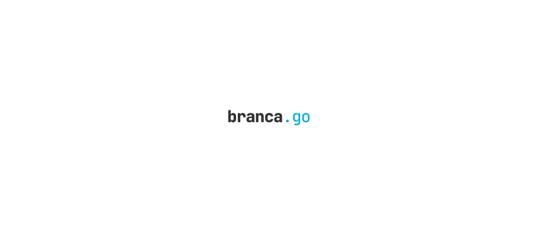

<p align="center"><a href="#readme"></a></p>

<p align="center">
  <a href="https://kaos.sh/g/branca.v2"></a>
  <a href="https://kaos.sh/r/branca"></a>
  <a href="https://kaos.sh/y/branca"></a>
  <a href="https://kaos.sh/l/branca"></a>
  <br/>
  <a href="https://kaos.sh/c/branca"></a>
  <a href="https://kaos.sh/w/branca/ci"></a>
  <a href="https://kaos.sh/w/branca/codeql"></a>
  <a href="#license"></a>
</p>

<p align="center"><a href="#installation">Installation</a> • <a href="#usage-example">Usage example</a> • <a href="#benchmarks">Benchmarks</a> • <a href="#build-status">Build Status</a> • <a href="#license">License</a></p>

<br/>

`branca.go` is [branca token specification](https://github.com/tuupola/branca-spec) implementation for [Go 1.18+](https://github.com/essentialkaos/.github/blob/master/GO-VERSION-SUPPORT.md).

Features and benefits:

* Pure Go implementation;
* No third-party dependencies at all;
* 100% code coverage;
* Fuzz tests.

### Installation

Make sure you have a working [Go 1.18+](https://github.com/essentialkaos/.github/blob/master/GO-VERSION-SUPPORT.md) workspace (_[instructions](https://go.dev/doc/install)_), then:


```bash
go get -u github.com/essentialkaos/branca/v2
```

### Usage example

```go
package main

import (
  "fmt"
  
  "github.com/essentialkaos/branca/v2"
)

func main() {
  key := "abcd1234abcd1234abcd1234abcd1234"
  brc, err := branca.NewBranca([]byte(key))

  if err != nil {
    fmt.Printf("Error: %v\n", err)
    return
  }

  payload := "MySuperSecretData"
  token, err := brc.EncodeToString([]byte(payload))

   if err != nil {
    fmt.Printf("Error: %v\n", err)
    return
  }

  fmt.Printf("Token: %s\n", token)
}

```

### Benchmarks

You can run benchmarks by yourself using `make benchmark` command.

```
go version go1.23.2 linux/amd64

BrancaSuite.BenchmarkBase62Decoding            1000000   1106 ns/op   408 B/op    7 allocs/op
BrancaSuite.BenchmarkBase62Encoding            1000000   1105 ns/op   512 B/op    6 allocs/op
BrancaSuite.BenchmarkBrancaDecoding            5000000    421 ns/op    48 B/op    2 allocs/op
BrancaSuite.BenchmarkBrancaDecodingFromString  1000000   1632 ns/op   456 B/op    9 allocs/op
BrancaSuite.BenchmarkBrancaEncoding            1000000   2108 ns/op   152 B/op    4 allocs/op
BrancaSuite.BenchmarkBrancaEncodingToString     500000   3854 ns/op   664 B/op   10 allocs/op
```

### Build Status

| Branch | Status |
|--------|----------|
| `master` | [](https://kaos.sh/w/branca/ci?query=branch:master) |
| `develop` | [](https://kaos.sh/w/branca/ci?query=branch:develop) |

### License

[MIT](LICENSE)

<p align="center"><a href="https://essentialkaos.com"></a></p>